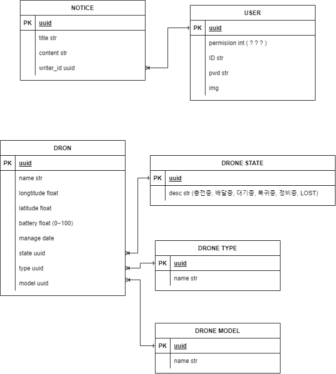

# ERD
erd diagram for database struct

# EndPoint

서비스 엔드 포인트 디자인 대한 명세.

## User Service

### Auth EndPoint

| url         | method | action                                |
| ----------- | ------ | ------------------------------------- |
| auth        | Post   | 로그인, 로그인 된 유저 정보 반환      |
| auth        | Get    | 로그인 확인, 로그인 된 유저 정보 반환 |
| auth/regist | Post   | 회원가입                              |

### User

| url        | method | action         |
| ---------- | ------ | -------------- |
| users      | get    | 유저 목록      |
| users/{id} | get    | 유저 정보      |
| users/{id} | put    | 유저 정보 수정 |

## Dron Service

### Dron EndPoint

| url        | method | action             |
| ---------- | ------ | ------------------ |
| Drons      | Post   | 드론 추가          |
| Drons      | Get    | 드록 목록          |
| Drons/{id} | Get    | 드론 정보 가져오기 |
| Drons/{id} | Put    | 드론 정보 업데이트 |
| Drons/{id} | Delete | 드론 삭제          |

## Notice Service

### Notice

| url          | method | action          |
| ------------ | ------ | --------------- |
| notices      | Post   | 게시글 추가     |
| notices      | Get    | 게시글 목록     |
| notices/{id} | Get    | 게시글 정보     |
| notices/{id} | Delete | 게시글 삭제     |
| notices/{id} | Put    | 게시글 업데이트 |
